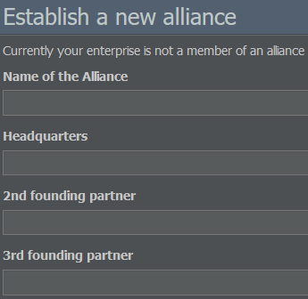
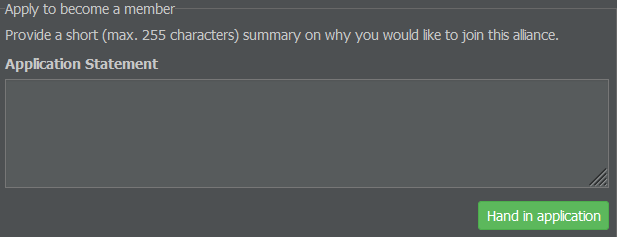

# Alliances

If you're looking for ways to connect with other players in-game, you may consider joining an alliance. What's that about, you ask?

Alliances are formal business cooperation agreements between a number of companies. They add a taste of reality to the game and are a great way to enjoy AirlineSim with your fellow players. The goals of an alliance, its membership criteria and other formalities are decided internally by its members.

Some alliances "create" extra hubs by interlining and flying at the same time to the same airport. Others help their members by purchasing shares if they go public, operate their own helpdesk to advise new members or set up rules about interlining. As you can see, the possibilities are endless: From friendly chat to fully realized interlining agreements - a good alliance can offer all of that and more!

## How can I join?

If you want to join an alliance, you have several options: You can create an alliance as a founding member, be invited or apply for membership. Note that a company can only be part of one alliance at a time: If you're already a member of an alliance, you have to leave before you can apply to join another.

### Founding an Alliance

In order to create a new alliance, three founding members are needed - yourself and two others. In the New Alliance menu of the Commercial tab, enter the name of your alliance, its headquarters and the names of the second and third founding members.

The first founding member is the one that sets up the alliance. The two others will be notified and can approve or reject the request. An alliance is formed once all founding members have agreed.

### Applying for Membership

If you're planning to join an existing alliance, have a look at its information page (you can access a list of the available alliances in the Database tab). Here, you'll find a membership application form (not visible if you are already a member of an alliance).

The information you enter here helps the alliance members to decide on your application. You can also ask what their alliance does, what they like about it or how members help each other. This way, you know what to expect if you join.

After submitting your request, all current members will receive a message about the application and must vote. If the majority approves, you're officially a member!

## Managing Alliances

Once you're part of an alliance, you can contribute as a member, a manager or a director. 

Members are limited to participating in discussions and decisions concerning the admission of new members. Managers can change the information for an alliance. A director has access to a dedicated Director tab and can appoint managers, delegate responsibility, expel members or resign and nominate a successor.

Management tasks can only be performed by managers or directors. They can customize the alliance by adding a company profile as well as a large and small logo. The small logo can have a size of up to 23 x 23 pixels and will be displayed on arrival and departure boards for all flights of the alliance's members.

## Alliance Overview

You can find more details regarding an alliance by looking up its information page. 

The Overview section lists all alliance members together with their status and a geographical display of their hubs. If you're part of an alliance, any outstanding membership applications will be shown here as well. Remember that each member has one opportunity to vote and the more members the alliance has, the more votes must be cast.

The Facts and Figures tab shows a summary of combined statistical information for all alliance members, such as revenue, transported passengers and cargo.

The Flight Schedule section displays the members' combined flight plans.
