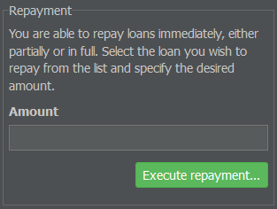
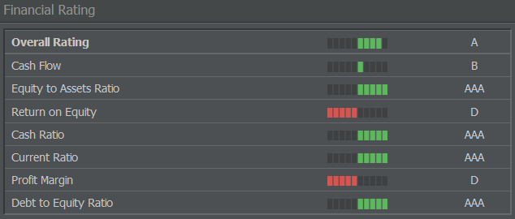

# Bankruptcy and Loans

## Inability to Pay

Inability to pay or insolvency means that a natural person or legal entity isn't able to pay for bills through their own cash flow, meaning the regular income isn't sufficient to cover the regular costs. In most cases, the credit limit is used up as well. This often results in giving up the company and ceasing commercial operations.


**Info**  
In AirlineSim, there is no overdraft credit to pay leasing installments or salaries from, so your company's liquidity is determined by the balance of your bank account.


If you're unable to pay the leasing rate of an aircraft, your enterprise is considered unable to pay at that specific moment. In that case, the leasing contract will be immediately terminated, the aircraft returned and the security deposit (minus the leasing rate) refunded to your bank account.

If you can't pay the salaries of your employees during week-end closing, consequences are more serious as your enterprise will be liquidated.

So, without enough observation, even a healthy enterprise can run into financial difficulties. It's important to calculate accurately and build some cash reserves as long as your enterprise is making profit. A timetable can help monitoring fixed costs (leasing rates, ground handling), loans, salaries and predicted dividend payout.

## Company Liquidation

If an enterprise is liquidated due to inability to pay at the time of week-end closing or if the enterprise is given up in the meantime, it'll be dissolved as follows:

* Aircraft are returned to the lessor (security deposit is refunded minus the leasing costs) or marketed (at 15% of its book value).
* Employees are laid off (salaries plus compensation are paid).
* Loans are paid off (interests are calculated pro rata).
* Buildings are demolished (for a fee).

The liquidation process is completed by paying out the leftover amount to the superordinate enterprise.

## Credit System

In AirlineSim, loans are managed and paid out by the AS-Bank. The creditworthiness and therefore maximal sum of loans you're offered as well as the corresponding interest are influenced by different factors:

* The rating of your enterprise,
* the amount of equity,
* the amount of already signed loans 
* and the amount of profit.

In intervals of seven days after signing the loan contract, the loan and interest have to be paid in rates. You can opt to dissolve the loan contract at any time if the balance of your bank account allows you to immediately settle the loan (plus an additional fee).

The game offers loans with and without securities.

### Loans Without Securities

Loans without securities allow you to raise your liquidity. If you sign a loan contract in the New Loan menu (by going to the Management tab and selecting Debt in the Corporate Finance section), you'll get a loan without securities. This type of loan isn't bound to any investments you plan, so the interest is a bit higher compared to a loan with securities. The specific interest for a loan without security depends on the current prime rate, but can be higher depending on your creditworthiness.

### Loans with Securities

Loans with securities are only offered when buying new aircraft, so they're always bound to a specific investment and won't raise the liquidity of your enterprise. Therefore, they are somewhat equal to a financed purchase. The specific object you invested in is used to safeguard your loan and will be passed into the AS-Bank's ownership in case of illiquidity. Given that, the AS-Bank is willing to offer higher loans and lower interests compared to a loan without securities.

## Ratings

Ratings play an important role when it comes to finances in AirlineSim. Your creditworthiness is represented by rating steps, with AAA being the best rating and D the worst:

AAA - AA - A - BBB - BB - B - CCC - CC - C - CI - D

You can review your airline's ratings on your company's overview page / dashboard.

### Impact of Ratings

The game evaluates each enterprise in matters of creditworthiness. The resulting rating is published (making it visible to every user) and updated after each transaction that may affect your creditworthiness.

Your rating (i.e. creditworthiness) influences three important parts of the game.

* **Financed purchases from AirlineSim**: If you want to lease an aircraft from an AS enterprise or purchase an aircraft financed by the AS-Bank, your rating must be at least B or better. Sometimes, even a rating of BB isn't sufficient. However, if an aircraft is leased from another lessor (i.e. another user), your rating doesn't matter, so you could lease a plane even with a CCC rating.

* **Interest and loans**: The lower your rating, the lower the maximal sum of loans you're offered and the more the interest differs from the prime rate. Most of the time, the AS-Bank won't offer any new loans when your rating is CCC or lower. Depending on the debt-to-equity ratio, you're usually not even offered new loans with a B rating.

* [**IPOs (Initial Public Offerings)**](): An IPO isn't possible if your rating is BBB or lower. Remember that potential investors will take a look at your rating, so an IPO with a minimum rating of A or marginally better might frighten them off. The better your rating, the better your impression.

### Evaluated Parameters

Ratings are calculated from several financial parameters of the evaluated enterprise, such as the equity-to-debt ratio (your loans) and predicted cash flow. The exact formula is confidential, but here is an overview of some of the evaluated factors.

* **Cash Flow**: This describes the net gain in a fixed period. In AirlineSim, this is simplified as the profit from your Profit and Loss Statement, minus write-offs (you can find the statement by going to the Management tab, selecting Accounting and navigating to the Balance Sheet).

* **Cash Reserve**: This is the amount of freely available capital on your bank account.

* **Equity-to-Fixed-Assets Ratio**: The refers to the ratio between your assets (i.e. your flight equipment account, security deposits and optional buildings) and net equity. In theory, there are three ratios, but the game uses the first one. It's evaluated as follows: Equity-to-Fixed-Assets Ratio = Equity / Assets x 100.

* **Equity Ratio**: This represents the amount of your own cash (including that of your shareholders) in your enterprise. Loans are considered debt capital. Example: If a company's balance sheet shows a total asset amount of 100 million AS$ and loans of 35.5 million AS$, it has an Equity Ratio of 64.5%.

* **Return on Equity (ROE)**: This value refers to the yield of the used capital in a specific timeframe and describes how much money an airline gains from the available net equity. The ratio is calculated as follows: Return on Equity = Profit / Net Equity x 100.

* **Cash Ratio**: This parameter describes the short-term ability to meet financial obligations, calculated as follows: Cash Ratio = Liquid Assets (the cash on your bank account) / Short-Term Debts (all regular payments like salaries, leasing rates etc.)

* **Current Ratio**: Same as the Cash Ratio, but in this case, current assets (liquid assets plus security deposits) are considered liquid assets as well.

* **Profit Margin**: This is the percentage of profit from your earnings (per week in AirlineSim). It's calculated as follows: Profit Margin = Profit / Earnings x 100

* **Debt Ratio**: The Debt Ratio is the part of loans compared to your total assets, so it's somewhat the opposite of your profit margin. It's calculated as follows: Debt Ratio = Loans / Equity x 100

## Prime Rates

In reality, the responsible central banking authority defines prime rates in given intervals. In AirlineSim, prime rates aren't written in stone. They are adjusted to the current development of a game world and may change several times a day. Therefore, they can perish larger and more frequent up- and downturns compared to reality.

On the front page of every game world, two prime rates are shown: One for loans without securities and another for loans with securities. Keep in mind that the prime rates stated here require you to have an AAA rating - if your rating is lower, the AS-Bank may ask for higher interest.
