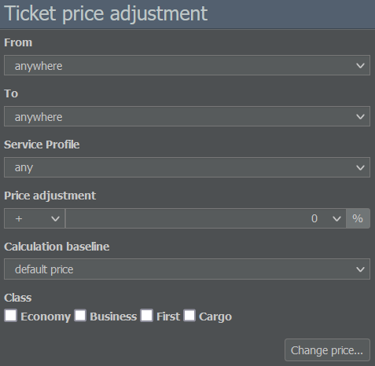

# Ticket Prices

## How much will passengers pay?

Actually, the answer is fairly simple: If you're the only airline in the area, passengers will pay through the nose to board your planes. They may hate you for it, but they will pay. However, you're rarely the only available airline, so here are a few rules of thumb to guide you through the process of choosing ticket prices.

First off, if you're offering decent seats and on-board service, you can try selling tickets that lie 25% above the default price. Depending on the type of plane, that should result in a profit margin of around 30%.

You can also consider selling domestic flight tickets for a little more, especially if you are on speaking terms with your competitors. Internationally, the competition is often too complicated to negotiate pricing strategies. In that case, it comes down to trial and error and taking the time to check your routes.

Last but not least, don't ignore the invisible competition: You may have loads of passengers on a route from airport A to your hub, but suddenly, their numbers go down although you see no competition. This can happen if some of your passengers were only flying to your hub in order to catch a connecting flight to airport B. If another airline starts flying between airport A and B, passengers prefer a direct flight.

Or perhaps the other airline also offers a connection from A to B through their hub, but at a cheaper price. As you can see, there are many possibilities, so try to keep an eye on the market.

## Helpful Tools

In case you're still a bit unsure about your ticket prices, you can always rely on the game's tools for guidance.

* The **Market Analysis** page shows you a list of all bookable flights on a certain route. It tells you how much your competitors charge for a ticket and whether their flights are fully booked or not.

* The **Fleet List** of a country displays details regarding your competitors' cabin configurations. The number of seats for each class can be viewed in the config. column and may give you an idea of the seat types that they are using. If a player employs standard seats, they can afford to drop their prices; if they offer pricier seats, they can sell more expensive tickets and still be an attractive choice.

* The [**Online Reservation System**]() tells you which flights have the highest ratings. Obviously pricing is important, but the total time of a journey is taken into account as well. A short transfer time can make your flights more appealing to customers.

## Analyzing the Competition

If you want to see how competing companies are doing, you can check out their stock market information (if they have gone public) or have a look at their weekly turn-over and profit margin.

The Statistics page may also be a useful source of information: Divide the number of passengers an airline transported last week by the number of seats they offered and you get their load factor.

If your competitor has a B rating, a profit margin of 5% and an average load factor of 75%, try lowering your prices until your planes are fully booked. If the opposite is the case, you may want to find a route that is more profitable.
