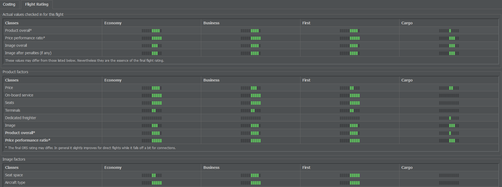

# Flight Rating System

As its name suggests, the Flight Rating System (FRS) is designed to provide airlines with a detailed quality evaluation of individual flights. The ratings it provides are also used to calculate the influence a flight has on the airline's image.

The evaluation can be accessed via the Inventory or Flight Numbers page in the Commercial tab. Just click on the small white arrow next to a flight and you'll see its Flight Information page. 

The ratings can be found in the Flight Rating tab and consist of two operationally separate components: Product and image factors. Both are listed together with the influence that the flight will have on the airline's image.

## Product Factors

Product factors describe an airline's image taken as a whole. They influence passengers as they book their flights and consist of parameters like price, on-board service and seating quality.

The individual factors are weighted differently, depending on the class - Economy, Business, First or Cargo - and the flight's distance: A passenger taking a short flight in Economy class will be significantly less picky than one flying halfway around the world in Business. And, as each class possesses its own image value, a great reputation for moving freight won't necessarily mean anything to passengers!

In the Flight Rating tab, you'll see the list of factors along with colored bars which represent their associated ratings: Green bars equal good or excellent product ratings; red bars indicate poor or lousy product ratings.

## Image Factors

Image factors include a bit less tangible aspects than product factors, such as the type of seats an aircraft is equipped with. Each completed flight affects your airline's image - how exactly depends on the "soft" factors of the flight like the amount of room, the aircraft's condition and the staff's mood, which makes investment (or lack of it!) in these areas a significant factor in differentiating airlines.

The image is formed over time, based on the subjective experiences of passengers after they've completed their flights. This is why decisions have long-term effects: An airline that transitions from flying ancient, uncomfortable aircraft to comfortable, modern aircraft overnight will not see an immediate change in the average passenger's opinion of them.

Just like before, the Flight Rating tab will show green bars if you have a good or excellent image and red bars if your image is poor or lousy.

## Flight Rating

The overall Flight Rating derives from evaluating both of the above-mentioned factors. This rating is then set against the price of the flight to produce a value called the Price-Performance Ratio (PPR). This only directly affects passengers flying between the two evaluated destinations - a positive PPR will, generally speaking, attract at least some traffic, whereas a negative PPR will not.

Bear in mind, however, that connection options at either end of the flight may improve the PPR of two flights combined sufficiently for passengers to book a sector with a negative PPR. Factors such as the time spent transferring between flights and the total flight time will be taken into account when calculating connections.

## Ground Connections

Ground connections - that is, passenger travel by car, bus, train etc. - are almost always available and are considered the baseline value for any individual flight or connection evaluation. They have a neutral PPR by default; consequently, flights or connections with a PPR below that of ground transportation usually won't receive any passengers.
