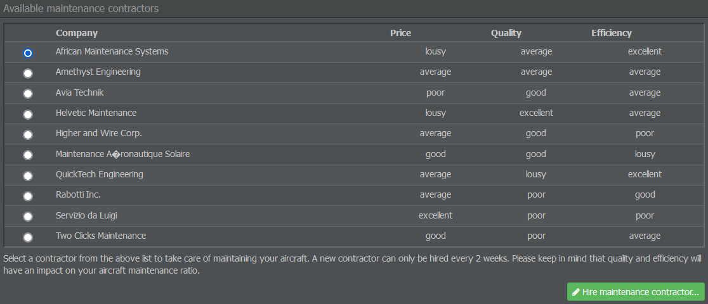

# Maintenance

## Booking Maintenance

Okay, you have your aircraft, routes, service, staff and cabins all figured out - time to start flying? Not just yet, you still need a maintenance provider! Without repairs, your aircraft won't be flying for very long…

In the Operations tab, select Maintenance and choose a maintenance company servicing your aircraft. There are several options with certain advantages and disadvantages. Every provider has different values regarding price, quality and the duration of maintenance.

* Price: This represents the relative cost of performing the same amount of maintenance on an aircraft.
* Quality: This indicates the maintenance standard. Be careful: A low-quality provider may never get your aircraft to 100% condition.
* Efficiency: This stands for the amount of maintenance that is achieved in a specific time span. A very efficient provider will get more work done in less time compared to an inefficient one; still, it may not be worth the price, especially if your aircraft spends a long time on the ground.

When thinking about maintenance, try to avoid looking at the price first. Instead, choose a provider that suits your planned operations. You can also select a maintenance provider later, but if you're going to prepare flight plans soon, it's probably best to pick one now. Changing providers afterwards will affect the amount of time your aircraft can spend in the air and determine how long they have to stay on the ground per day, so you may have to change your flight plans accordingly.


**Important**  
Once you have selected a maintenance company, you won't be able to change it for two weeks.


## Additional Tips

Here is some advice on maintenance and its integration into your flight schedule (which we'll cover soon).

* Minimum flight plan gap: If you want maintenance to take place between your flights, your flight schedule needs to leave a minimum gap of 120 minutes (incl. turnaround times). With a ground time of 119 minutes and below, no maintenance will be carried out.
* Price, quality or efficiency? Symmetric flight schedules with daily maintenance windows allow you to go for a maintenance contractor that is efficient and cheap. However, asymmetric schedules may shift your focus from the price towards a contractor offering higher quality maintenance in order to slow down the deterioration of your aircrafts' condition.
* Owned planes: Owning aircraft allows your flight plans to be less tight. Instead of cramping the schedule, you can leave gaps for connecting flight waves. Going for a cheaper provider may be worth sacrificing quality and / or efficiency in some cases and reduce maintenance costs for every single flight. Seems odd? No! A popular real life example for this strategy is [Allegiant Air](http://en.wikipedia.org/wiki/Allegiant_Air#Costs).
* Aircraft age: The age of your aircraft doesn't affect the amount of time required for maintenance, but does influence the costs. The older your plane, the more spare parts will be used during maintenance, as failures and wear take their toll.
